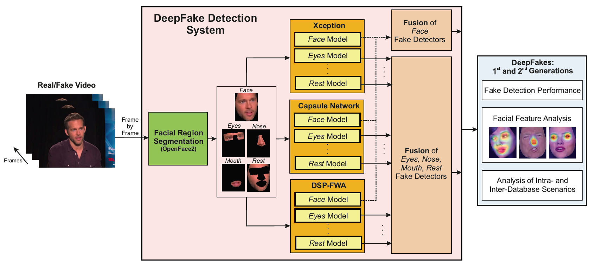
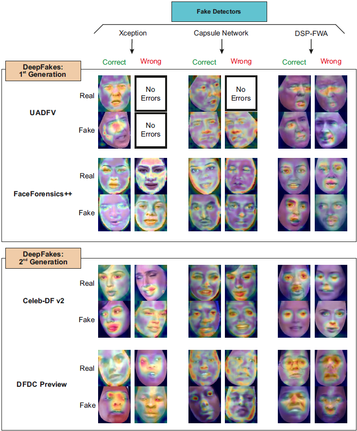
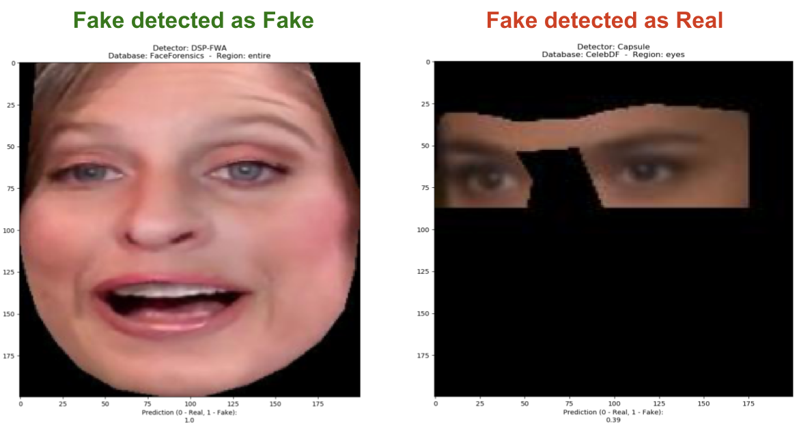

<a href="http://atvs.ii.uam.es/atvs/">
    
</a>

# DeepFakes Detection: Facial Regions

Media forensics has attracted a tremendous attention in the last years in part due to the increasing concerns around **DeepFakes**. Since the release of the initial DeepFake databases of the **1st generation** such as UADFV and FaceForensics++ up to the latest databases of the **2nd generation** such as Celeb-DF and DFDC, many visual improvements have been carried out, making fake videos almost indistinguishable to the human eye. This GitHub provides the DeepFakes detectors trained in the following reference:

**[DeepFakes_Facial_Regions2022]** R. Tolosana, S. Romero-Tapiador, R. Vera-Rodriguez, E. Gonzalez-Sosa and J. Fierrez, **"DeepFakes Detection across Generations: Analysis of Facial Regions, Fusion, and Performance Evaluation"**, *Engineering Applications of Artificial Intelligence*, 110, 2022.

**Two different methods** are studied in our experimental framework: i) the traditional one followed in the literature based on **selecting the entire face** as input to the fake detection system, and ii) a novel approach based on the **selection of specific facial regions** as input to the fake detection system. 

## Table of content

- [Overview](#overview)  
    - [Proposed Evaluation Framework](#proposed)
        - [Facial Region Segmentation](#facial)
        - [Fake Detection Systems](#system)
        - [Fusion](#fusion)
    - [References](#references)
- [How to use DeepFakes Detector](#setup)
    - [Install & Requirements](#install)
    - [Run the Detector](#run)
- [Citation](#cite)
- [Contact](#contact)


## <a name="overview">Overview<a>

Our study provides an in-depth analysis of both 1st and 2nd DeepFake generations in terms of fake detection performance. Fusion techniques are applied both to the facial regions and also to three different state-of-the-art fake detection systems (Xception, Capsule Network, and DSP-FWA) in order to further increase the robustness of the detectors considered. The following figure summarises our evaluation framework, comprising three main modules: **i) facial region segmentation**, **ii) fake detection systems**, and **iii) fusion techniques**. 
    

### <a name="proposed">Proposed Evaluation Framework<a>
  
<p align="center"></p>

    
#### <a name="facial">Facial Region Segmentation<a>
**Two different approaches** are studied: i) **segmenting the entire face** as input to the fake detection system, and ii) **segmenting only specific facial regions**. Regarding the second approach, 4 different facial regions are selected: **Eyes**, **Nose**, **Mouth**, and **Rest** (i.e., the part of the face obtained after removing the eyes, nose, and mouth from the entire face). For the segmentation of each region, we consider the opensource toolbox [OpenFace2](https://github.com/TadasBaltrusaitis/OpenFace). For more details, please see Sec. 3.1 of the article.
    
#### <a name="system">Fake Detection Systems<a>

**Three** different state-of-the-art **fake detection approaches** are considered in our evaluation framework:

+ **Xception** [1]: is a CNN architecture inspired by Inception, where Inception modules have been replaced with depthwise separable convolutions. In our evaluation framework, we follow the same training approach considered in [2]: i) we first consider the Xception model pre-trained with ImageNet, ii) we change the last fully-connected layer of the ImageNet model by a new one (two classes, real or fake), iii) we fix all weights up to the final fully-connected layer and re-train the network for few epochs, and finally iv) we train the whole network for 20 more epochs and choose the best performing model based on validation accuracy.
+ **Capsule Network** [3]: we consider the same detection approach proposed by Nguyen et al., which is publicly available in [GitHub](https://github.com/nii-yamagishilab/Capsule-Forensics-v2). It is based on the combination of traditional CNN and recent Capsule Networks, which require fewer parameters to train compared with traditional CNN. In particular, the authors proposed to use part of the VGG19 model pre-trained with ImageNet database for the feature extractor (from the first layer to the third max-pooling layer). The output of this pre-trained part is concatenated with 10 primary capsules and finally 2 output capsules (real and fake). 
+ **DSP-FWA** [4]: this detection system is based on the detection of the warping artifacts included in DeepFake videos, where this new version Spatial Pyramid Pooling handle  in a better way the variations in the resolutions of the faces. We consider the same implementation details released by the authors in [GitHub](https://github.com/danmohaha/DSP-FWA).
    
For more details, please see Sec. 3.2 of the article.
    
#### <a name="fusion">Fusion<a>
    
Fusion techniques are finally considered to develop **more robust** fake detectors. **Two different approaches** are considered: i) **fusion of 3 complementary state-of-the-art** fake detectors (Xception, Capsule Network, and DSP-FWA), and ii) **fusion of different facial regions** (Eyes, Nose, Mouth, and Rest). In all cases we consider fusion techniques at **score level**. For more details, please see Sec. 3.3 of the article.
    
As a result, **great performances** have been achieved using facial regions with **fake detection results above 99% Area Under the Curve (AUC)** for UADFV, FaceForensics++, and Celeb-DF v2 databases. Also, fusion of multiple detectors has proven to be very useful under inter-database scenarios. Nevertheless, different approaches could be further studied to increase the **robustness** of the fake detectors **against unseen attacks**.
   
The following Figure shows correct and wrong decisions of the fake detectors (based on the complete Face) with their corresponding [Grad-CAM heatmaps](https://github.com/ramprs/grad-cam), **representing the most useful areas** inside the face image for each fake detector. 
    
<p align="center"></p>

    
### <a name="references">References<a>
**[1]** F. Chollet, Xception: Deep Learning with Depthwise Separable Convolutions, in: *Proc. IEEE/CVF Conference on Computer Vision and Pattern Recognition*, 2017.
    
**[2]** A. Rössler, D. Cozzolino, L. Verdoliva, C. Riess, J. Thies, M. Nießner, FaceForensics++: Learning to Detect Manipulated Facial Images, in: *Proc. IEEE/CVF International Conference on Computer Vision*, 2019.
    
**[3]** H.H. Nguyen, J. Yamagishi and I. Echizen, Use of a Capsule Network to Detect Fake Images and Videos, *arXiv:1910.12467*, 2019.
    
**[4]** Y. Li, X. Yang, P. Sun, H. Qi, S. Lyu, Celeb-DF: A Large-Scale Challenging Dataset for DeepFake Forensics, in: *Proc. IEEE/CVF Conference on Computer Vision and Pattern Recognition*, 2020.
    
    
## <a name="setup">How to use DeepFakes Detector<a>
The three start-of-the-art fake detection systems are implemented in order to execute them in a few steps. Two of them (DSP-FWA and Capsule Networks) are implemented in Pytorch library, meanwhile Xception Network is implemented in Keras. Therefore, two different environments have to be installed for using all the detectors.
    
**IMPORTANT**: **this repository must be downloaded or cloned** in order to use our DeepFakes detectors. Also, **the detector models have to be downloaded from our [server](http://atvs.ii.uam.es/atvs/models)**. This downloaded folder (called "models") should be **added inside of the repository folder**.
    
### <a name="install">Install & Requirements<a>
 Please, follow the steps to install them properly:

1) Install [Conda](https://docs.conda.io/projects/conda/en/latest/user-guide/install/)

2) Update Conda (from the Conda terminal):

```  
conda update conda
conda upgrade --all
```  
    
3) Create a new environment from .yml file:

+ For Pytorch library (DSP-FWA and Capsule Networks):
    
```  
conda env create -f DeepFakes_FacialRegion.yml
```  
    
+ For Keras library (Xception Network):
    
```  
conda env create -f DeepFakes_FacialRegion_Xception.yml
```  
    
4) Activate the created environment:
+ For Pytorch library (DSP-FWA and Capsule Networks):   
```  
conda activate DeepFakes_FacialRegion
```  
    
+ For Keras library (Xception Network):
    
```  
conda activate DeepFakes_FacialRegion_Xception
```   
    
### <a name="run">Run the Detector<a>
After installing the configuration for both environments, the DeepFakes detectors can be executed from the terminal as follows:
    
**NOTE**: to use any detector, the corresponding environment has to be activated before (Step 4).

+ For Pytorch library (DSP-FWA and Capsule Networks):   

```  
python deepfakes_facial_regions.py --detector [detector_name] --region [region_name] --ddbb [database_name] 
```  

+ For Keras library (Xception Network):
```  
python deepfakes_facial_regions_xception.py --region [region_name] --ddbb [database_name] 
```  

Where:
    
+ **--detector** are the different CNN's implemented: **DSP-FWA** or **Capsule** (only for PyTorch library)
+ **--region** are the different facial regions used: **entire**, **eyes**, **mouth**, **nose** or **rest**
+ **--ddbb** are the different databases used for training: **UADFV**, **FaceForensics**, **CelebDF** or **DFDC**
        
For instance: 
    
```  
python deepfakes_facial_regions.py --detector DSP-FWA --region eyes --ddbb CelebDF 
```      
    
Finally, the model will be ready for detecting whether the test image corresponds to a **real or a fake face** and showing the model prediction value between **0 and 1 (0 for real facial regions and 1 for fake ones)**. Some examples of the output are shown below:
    
<p align="center"></p>
    
## <a name="cite">Citation<a>
- **[DeepFakes_Facial_Regions2022]** R. Tolosana, S. Romero-Tapiador, R. Vera-Rodriguez, E. Gonzalez-Sosa and J. Fierrez, **"DeepFakes Detection across Generations: Analysis of Facial Regions, Fusion, and Performance Evaluation"**, *Engineering Applications of Artificial Intelligence*, 110, 2022.
    
All these articles are publicly available in the [publications](http://atvs.ii.uam.es/atvs/listpublications.do) section of the BiDA- Lab group webpage. Please, remember to reference the above articles on any work made public.
    
## <a name="contact">Contact<a>
  
For more information, please contact us via email at ruben.tolosana@uam.es or sergio.romero@uam.es.
